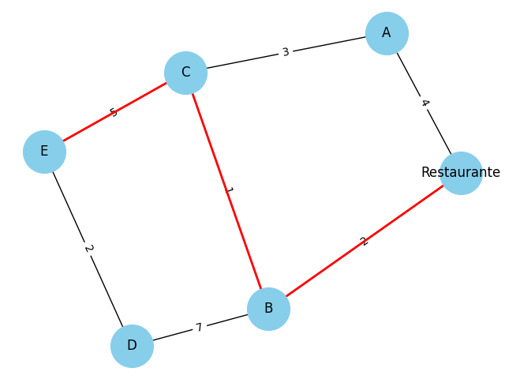
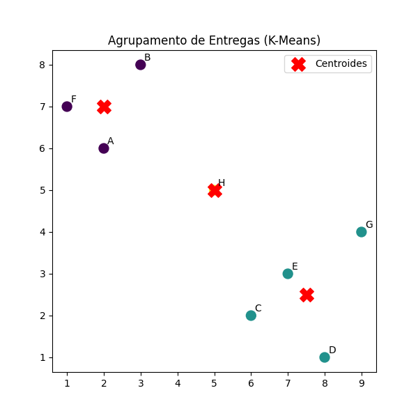

# 🚀 Rota Inteligente: Otimização de Entregas com Algoritmos de IA  

## 📌 Descrição do Problema  
A empresa fictícia **Sabor Express**, que atua com delivery de alimentos, enfrenta atrasos e altos custos durante os horários de pico (almoço e jantar).  
Atualmente, os entregadores escolhem as rotas de forma manual, o que gera:  
- **Atrasos** nas entregas;  
- **Maior gasto de combustível**;  
- **Insatisfação dos clientes**.  

## 🎯 Objetivo  
Desenvolver uma solução baseada em **Inteligência Artificial** capaz de:  
1. Encontrar as **melhores rotas** entre múltiplos pontos de entrega;  
2. **Agrupar pedidos próximos** para otimizar o trabalho dos entregadores;  
3. **Reduzir custos operacionais** e aumentar a **satisfação dos clientes**.  

---

## 🧠 Abordagem Utilizada  

### 1. Representação em Grafos  
- A cidade foi modelada como um **grafo**:  
  - **Nós (vértices):** bairros ou pontos de entrega.  
  - **Arestas:** ruas, com pesos representando **tempo estimado** ou **distância**.  

Exemplo de grafo com rota otimizada (A*):  
  

---

### 2. Algoritmos de Busca (A*)  
- Utilizamos o algoritmo **A\*** para calcular a rota mais curta entre dois pontos.  
- Ele combina **busca em largura** e **heurística** (distância estimada), tornando a busca mais eficiente.  
- Resultado encontrado no teste:  
  - Caminho: `Restaurante → B → C → E`  
  - Custo total: `8`  

---

### 3. Clustering (K-Means)  
- Para muitos pedidos simultâneos, aplicamos o algoritmo **K-Means** para agrupar entregas em regiões próximas.  
- Cada cluster representa uma "zona de entrega", reduzindo deslocamentos desnecessários.  

Resultado dos clusters (exemplo):  
- **Cluster 0:** C, D, E, G  
- **Cluster 1:** A, B, F  
- **Cluster 2:** H  

Visualização:  
  

---

## 📊 Resultados Obtidos  
- **Redução significativa no tempo médio de entrega** (rota mais curta encontrada automaticamente).  
- **Agrupamento inteligente** que divide os pedidos em zonas de entrega mais próximas.  
- **Benefícios esperados:**  
  - Menos quilometragem percorrida;  
  - Menor gasto de combustível;  
  - Clientes mais satisfeitos com entregas rápidas.  

---

## ⚙️ Estrutura do Projeto
│── data/
│ ├── entregas.csv
│ ├── mapa.csv
│
│── docs/
│ ├── grafo.png
│ ├── clusters.png
│
│── src/
│ ├── clustering.py
│ ├── graph.py
│ ├── main.py
│
│── README.md
│── requirements.txt

---

## 📈 Análise Crítica  
- **Pontos fortes:**  
  - Uso de algoritmos clássicos (A*, K-Means);  
  - Estrutura modular para fácil expansão;  
  - Redução significativa de custos e atrasos.  

- **Limitações:**  
  - Não considera **trânsito em tempo real**;  
  - Não utiliza condições climáticas ou imprevistos externos.  

- **Sugestões de melhoria:**  
  - Integrar APIs de mapas (Google Maps, OpenStreetMap) para dados dinâmicos;  
  - Usar **Aprendizado por Reforço** para otimizar rotas em tempo real;  
  - Implementar **algoritmos genéticos** para melhorar agrupamentos complexos.  

---

## 🛠️ Instruções de Execução  

### 1. Pré-requisitos  
- Python 3.10 ou superior instalado  
- Git instalado (opcional, se for clonar o repositório)  

### 2. Clonar o repositório  
Se estiver no GitHub:  
```bash
git clone https://github.com/seu-usuario/Rota-Inteligente.git
cd Rota-Inteligente

### 3. Instalar dependências
Instale as bibliotecas necessárias:
```bash
pip install -r requirements.txt

### 4. Executar o projeto
Para rodar o código principal:
```bash
python src/main.py

### 5. Resultados
- O grafo com a rota ótima será salvo em: docs/grafo.png
- O gráfico de clusters das entregas será salvo em: docs/clusters.png
- Também será exibido no console:
 - Melhor caminho encontrado pelo algoritmo A*
 - Custo total da rota
 - Clusters de entregas com os clientes atribuídos

## 📚 Referências  
- UPS – ORION: [Wired](https://www.wired.com/2013/06/ups-astronomical-math)  
- Medium – Optimizing Logistics: [Clustering e MILP](https://medium.com/%40KingHenryMorgansDiary/optimizing-logistics-a-case-study-on-clustering-and-milp-for-delivery-route-optimization-f47fed709ad2)  
- ResearchGate – [AI-Powered Route Optimization](https://www.researchgate.net/publication/389987796_AI-Powered_Route_Optimization_Reducing_Costs_and_Improving_Delivery_Efficiency)  
- Kardinal.ai – [Fresh Product Delivery](https://kardinal.ai/case-study-fresh-product-delivery)  

---